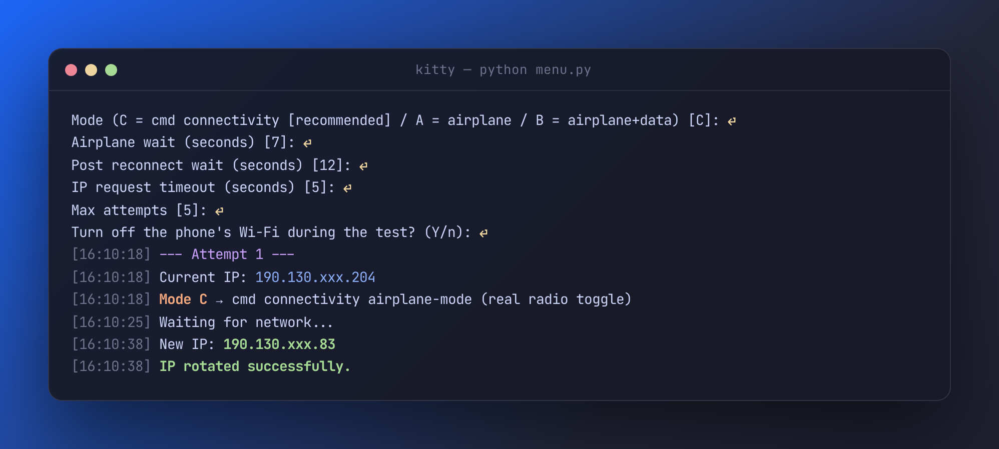
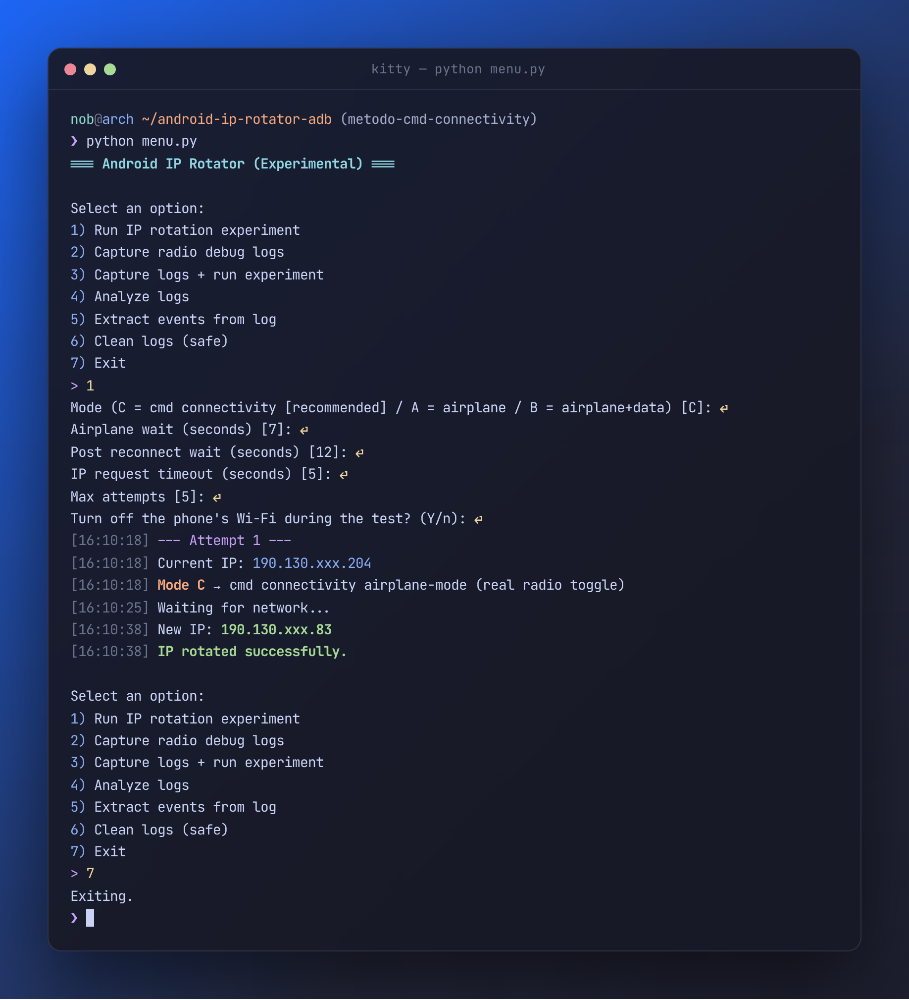

# Experimental Android IP Rotator (ADB)

**Idioma / Language:** [Español](#espanol) | [English](#english)

---

## Español

### Contenido
- [Descripción general](#descripción-general)
- [Quickstart (2 minutos)](#quickstart-2-minutos)
- [Descargas (Windows .exe)](#descargas-windows-exe)
- [Motivación](#motivación)
- [Entorno de pruebas real](#entorno-de-pruebas-real)
- [Arquitectura de alto nivel](#arquitectura-de-alto-nivel)
- [Qué hace este proyecto](#qué-hace-este-proyecto)
- [Qué NO hace este proyecto](#qué-no-hace-este-proyecto)
- [Metodología experimental](#metodología-experimental)
- [Modos de prueba](#modos-de-prueba)
- [Resultados observados](#resultados-observados)
- [Análisis de logs de radio](#análisis-de-logs-de-radio)
- [Conclusión principal](#conclusión-principal)
- [Uso básico](#uso-básico)
- [Dependencias](#dependencias)
- [Build local (Windows)](#build-local-windows)
- [CI/CD (GitHub Actions)](#cicd-github-actions)
- [Documentación extendida](#documentación-extendida)
- [Ética y alcance](#ética-y-alcance)
- [Créditos](#créditos)
- [Licencia](https://github.com/Nuulz/android-ip-rotator-adb/tree/main?tab=Unlicense-1-ov-file)
- [Nota final](#nota-final)

---

## Descripción general

Este repositorio documenta una **investigación técnica real y reproducible** cuyo objetivo es analizar si es posible forzar la **rotación de una dirección IPv4 pública** utilizando un teléfono Android conectado a un computador mediante **USB tethering**, controlando el estado de red **exclusivamente desde el PC usando ADB**, sin acceso root y sin aplicaciones firmadas como sistema.

Este proyecto **NO es una herramienta de anonimato ni de evasión**.  
Es un experimento diseñado para **entender y documentar los límites reales** de:

- Android (framework y radio)
- ADB
- El módem
- El operador móvil (CGNAT)

El valor del repositorio está en la **honestidad técnica**: mostrar qué funciona, qué no funciona y por qué.

---

## Quickstart (2 minutos)

### Requisitos
- **Python 3.11+**
- **ADB (Android platform-tools)** instalado y disponible en `PATH`
- Teléfono Android con **USB Debugging** habilitado
- (Según el modo) **USB tethering** activo

### Instalación
```
git clone https://github.com/Nuulz/android-ip-rotator-adb.git
cd android-ip-rotator-adb
python -m pip install --upgrade pip
pip install -r requirements.txt
```

### Ejecutar
```
python menu.py
```

---

## Descargas (Windows .exe)

Este repositorio genera un ejecutable de Windows automáticamente cuando se crea un **Release**.

ir a **Releases** y descargar `android-ip-rotator.exe`.


## Motivación

Existe una creencia común de que activar y desactivar el modo avión en Android siempre provoca un cambio de IP pública.  
Este proyecto busca responder, con evidencia técnica, a las siguientes preguntas:

- ¿Es posible forzar ese comportamiento únicamente desde ADB?
- ¿El toggle vía ADB es equivalente al toggle manual de la interfaz?
- ¿Qué papel juega el operador móvil (CGNAT) en la persistencia de la IP?
- ¿Qué ocurre internamente a nivel de radio cuando la IP cambia o no cambia?

La meta no es “hacer que funcione”, sino **entender como funciona**.

---

## Entorno de pruebas

| Componente | Valor |
| --- | --- |
| Dispositivo | Redmi Note 13 Pro Plus |
| Sistema operativo | HyperOS (basado en MIUI) |
| Operador móvil | Red móvil IPv4 bajo CGNAT |
| Conectividad | USB tethering |
| Sistema del PC | Windows |
| Root | No |
| VPN / Proxy | No |
| ADB | Activado |
| USB Debugging (Security settings) | Activado |

---

## Arquitectura

```
PC (Python CLI)
└─ ADB
└─ Android Framework
└─ Radio / RIL
└─ Red del operador (CGNAT)
```

El script actúa **desde el PC**, sin interacción manual durante la ejecución automática.

---

## Qué hace este proyecto

- Ejecuta experimentos controlados de reconexión de red
- Captura logs del subsistema de radio (`logcat -b radio`)
- Extrae eventos relevantes (attach/detach, cambios de estado)
- Registra ejecuciones (“runs”) de forma trazable
- Exporta resultados en JSON y CSV
- Permite limpiar logs de forma segura
- Documenta explícitamente las limitaciones del sistema

---

## Qué NO hace este proyecto

- No garantiza rotación de IP
- No evade CGNAT
- No es una herramienta de anonimato
- No utiliza exploits
- No modifica el firmware
- No ejecuta control profundo del módem

---

## Metodología experimental

Cada experimento sigue este flujo:

1. Medir la IP pública desde el PC
2. Ejecutar cambios de estado de red vía ADB
3. Esperar reconexión
4. Medir la IP pública nuevamente
5. Comparar resultados
6. Capturar y analizar logs de radio
7. Registrar la ejecución en un índice persistente

---

## Modos de prueba

### Modo A — Modo avión vía ADB
```
airplane_mode ON → esperar → airplane_mode OFF
```
Prueba si un corte lógico de radio es suficiente.

---

### Modo B — Modo avión + datos móviles vía ADB
```
airplane_mode ON → datos OFF → esperar → airplane_mode OFF → datos ON
```
Intenta forzar una desconexión más profunda.

---

### Modo C — `cmd connectivity airplane-mode` (recomendado)
```
[Wi-Fi del celular OFF] → airplane-mode enable → 7 s → airplane-mode disable → 12 s → medir IP
repetir hasta que la IP cambie (máx. 5) → [Wi-Fi del celular ON]
```
Usa `adb shell cmd connectivity airplane-mode enable|disable`, que pasa por `ConnectivityService` y **sí apaga el radio**, en vez de solo escribir el ajuste. Funciona sin root en Android 12+ (probado en Android 16, donde el broadcast `AIRPLANE_MODE` da `SecurityException`).

Antes de empezar apaga el Wi-Fi del celular (`svc wifi disable`) y lo restaura al final: con el Wi-Fi encendido, el tethering sale por la red de la casa y la IP que se mide no es la del operador.

Si el PC tiene su propio internet (cable o Wi-Fi), en Linux la IP se mide por la interfaz del tethering (`curl --interface`), así el PC no pierde conexión durante la prueba y la IP medida es la del celular.

Ejecución real (Redmi Note 13 Pro+, Android 16, Claro Colombia): la IP rotó al primer intento, en 20 s.



---

## Resultados observados

### Toggle manual (UI del sistema)
```
IP BEFORE: 190.130.xxx.xx
IP AFTER : 190.130.xxx.xx
```
✔ Se observa renegociación completa del radio  
✔ Cambios de canal y ancho de banda  
✔ Nueva sesión de red  
✔ Nueva IP pública asignada  

---

### Toggle vía ADB
```
IP BEFORE: 190.130.xxx.xx
IP AFTER : 190.130.xxx.xx
```
✘ No hay renegociación física consistente  
✘ El módem no se desancla completamente de la celda  
✘ El operador mantiene la misma sesión CGNAT  

---

## Análisis de logs de radio

Se utilizan logs del buffer `radio`:

```
adb logcat -b radio -c
adb logcat -b radio -v time | findstr /i "ServiceState RIL RADIO airplane"
```

Hallazgos clave:

- El toggle manual dispara eventos completos del framework y RIL
- El toggle vía ADB suele modificar solo flags lógicos
- Sin detach físico, la IP pública permanece “sticky”

---

## Conclusión principal

Este **no es un problema del script**.

Es una **limitación arquitectónica intencional de android**:

- ADB está sandboxeado por diseño
- El control profundo del radio requiere permisos de sistema
- La IP pública depende del attach físico y de políticas del operador
- Bajo CGNAT, las reconexiones rápidas reutilizan contexto de red

ADB **no puede garantizar** una rotación de IP sin acceso a APIs internas o control del RIL.

### Actualización: el problema era el comando

Los modos A y B usan `settings put global airplane_mode_on`, que **solo cambia el flag lógico**: eso explica que los logs no mostraran un detach real. Con `cmd connectivity airplane-mode` (Modo C) el radio sí se apaga y el operador sí termina entregando una IP nueva.

Bajo CGNAT el cambio **no es determinístico**: a veces la primera reconexión recupera la misma IP. Por eso el Modo C repite ciclos cortos hasta que la IP cambie, en vez de uno largo. Este mismo método es el que uso a diario desde Goket, mi panel de red.

---

## Uso básico

```
python menu.py
```

El menú interactivo permite:

- Ejecutar experimentos
- Capturar logs
- Analizar resultados
- Extraer eventos
- Limpiar ejecuciones de forma segura

<details>
<summary>Sesión completa</summary>



</details>

---

## Dependencias

`requirements.txt`:
- `requests>=2.31.0`
- `pyinstaller>=5.14.1`

> Nota: el workflow instala además `pillow` para generar el ícono.

---

## Build local (Windows)

```
pip install -r requirements.txt
pip install pyinstaller pillow
python tools/make_icon.py
pyinstaller --onefile --name android-ip-rotator --icon icon.ico menu.py
```

---

## CI/CD (GitHub Actions)

Workflow: `.github/workflows/build.yml`  
Trigger: al crear un **Release** (`on: release -> types: [created]`)  

---

## Documentación extendida

La documentación técnica detallada (metodología, logs, eventos, CGNAT, arquitectura interna) se encuentra en la **Wiki del repositorio**:

**ESTO SE SIGUE CONSTRUYENDO**

https://github.com/Nuulz/android-ip-rotator-adb/wiki

---

## Ética y alcance

Este proyecto se desarrolló con fines **educativos y de investigación**:

- Todo se ejecuta en entornos controlados
- No se afecta infraestructura de terceros
- No se promueve evasión ni anonimato

---

## Créditos

Proyecto desarrollado por el autor del repositorio.

Herramientas de IA (ChatGPT, OpenAI) se utilizaron únicamente como apoyo para análisis, organización y redacción.  
Toda la experimentación, validación y conclusiones provienen de pruebas reales sobre hardware y red.

---

## Nota final

Este repositorio no intenta “ganarle al sistema”.  
Intenta **entenderlo**.

---

# English

## Index
- [Overview](#overview)
- [Quickstart (2 minutes)](#quickstart-2-minutes)
- [Downloads (Windows .exe)](#downloads-windows-exe)
- [Motivation](#motivation)
- [Real test environment](#real-test-environment)
- [High-level architecture](#high-level-architecture)
- [What this project does](#what-this-project-does)
- [What this project does NOT do](#what-this-project-does-not-do)
- [Experimental methodology](#experimental-methodology)
- [Test modes](#test-modes)
- [Observed results](#observed-results)
- [Radio log analysis](#radio-log-analysis)
- [Main conclusion](#main-conclusion)
- [Basic usage](#basic-usage)
- [Dependencies](#dependencies)
- [Local build (Windows)](#local-build-windows)
- [CI/CD (GitHub Actions)](#cicd-github-actions-1)
- [Extended documentation](#extended-documentation)
- [Ethics & scope](#ethics--scope)
- [Credits](#credits)
- [License](https://github.com/Nuulz/android-ip-rotator-adb/tree/main?tab=Unlicense-1-ov-file)
- [Final note](#final-note)

---

## Overview

This repository documents a **real, reproducible technical investigation** focused on whether it is possible to force **public IPv4 rotation** using an Android phone connected to a computer via **USB tethering**, controlling network state **from the PC only using ADB**, with no root access and no system-signed apps.

This project is **NOT** an anonymity or evasion tool.  
It is an experiment meant to **understand and document real-world limits** across:

- Android (framework + radio)
- ADB
- The modem
- The mobile carrier (CGNAT)

The value is **technical honesty**: showing what works, what doesn’t, and why.

---

## Quickstart (2 minutes)

### Requirements
- **Python 3.11+**
- **ADB (Android platform-tools)** installed and available in `PATH`
- Android device with **USB Debugging** enabled
- (Depending on the mode) **USB tethering** enabled

### Install
```
git clone https://github.com/Nuulz/android-ip-rotator-adb.git
cd android-ip-rotator-adb
python -m pip install --upgrade pip
pip install -r requirements.txt
```

### Run
```
python menu.py
```

---

## Downloads (Windows .exe)

This repository builds a Windows executable automatically when a **Release** is created.

go to **Releases** and download `android-ip-rotator.exe`.

---

## Motivation

There is a widespread belief that activating airplane mode always forces a change in the public IP address.  
This project aims to answer the following questions with technical tests:

- Can this be forced using only ADB?
- Is activating ADB equivalent to activating the user interface?
- How does the operator's CGNAT affect the “persistent” behavior of the public IP?
- What happens at the radio/RIL level when the IP changes (or does not change)?

The goal is not to “make it work,” but to **understand how it works internally**.

---

## Test environment

| Component | Value |
| --- | --- |
| Device | Redmi Note 13 Pro Plus |
| OS | HyperOS (MIUI-based) |
| Carrier | Mobile IPv4 under CGNAT |
| Connectivity | USB tethering |
| PC OS | Windows |
| Root | No |
| VPN / Proxy | No |
| ADB | Enabled |
| USB Debugging (Security settings) | Enabled |

---

## Architecture

```
PC (Python CLI)
└─ ADB
└─ Android Framework
└─ Radio / RIL
└─ Carrier network (CGNAT)
```

The script runs **from the PC**, with no manual interaction during automated execution.

---

## What this project does

- Runs controlled network reconnection experiments
- Captures radio subsystem logs (`logcat -b radio`)
- Extracts relevant events (attach/detach, state changes)
- Tracks runs in a persistent, traceable way
- Exports results to JSON and CSV
- Supports safe log clearing
- Explicitly documents system limitations

---

## What this project does NOT do

- Does not guarantee IP rotation
- Does not bypass CGNAT
- Is not an anonymity tool
- Does not use exploits
- Does not modify firmware
- Does not perform deep modem control

---

## Experimental methodology

Each experiment follows:

1. Measure public IP from the PC
2. Apply network state changes via ADB
3. Wait for reconnection
4. Measure public IP again
5. Compare results
6. Capture/analyze radio logs
7. Persist the run in an index

---

## Test modes

### Mode A — Airplane mode via ADB
```
airplane_mode ON → wait → airplane_mode OFF
```

### Mode B — Airplane mode + mobile data via ADB
```
airplane_mode ON → data OFF → wait → airplane_mode OFF → data ON
```

### Mode C — `cmd connectivity airplane-mode` (recommended)
```
[phone Wi-Fi OFF] → airplane-mode enable → 7 s → airplane-mode disable → 12 s → measure IP
repeat until the IP changes (max 5) → [phone Wi-Fi ON]
```
Uses `adb shell cmd connectivity airplane-mode enable|disable`, which goes through `ConnectivityService` and **really powers the radio off** instead of just writing the setting. Works without root on Android 12+ (tested on Android 16, where the `AIRPLANE_MODE` broadcast throws `SecurityException`).

It turns the phone's Wi-Fi off first (`svc wifi disable`) and restores it at the end: with Wi-Fi on, tethering exits through the home network and the measured IP is not the carrier's.

If the PC has its own internet (Ethernet or Wi-Fi), on Linux the IP is measured through the tethering interface (`curl --interface`), so the PC never loses connectivity during the test and the measured IP is the phone's.

Real run (Redmi Note 13 Pro+, Android 16, Claro Colombia): the IP rotated on the first attempt, in 20 s.


---

## Observed results

### Manual UI toggle
```
IP BEFORE: 190.130.xxx.xx
IP AFTER : 190.130.xxx.xx
```

### ADB toggle
```
IP BEFORE: 190.130.xxx.xx
IP AFTER : 190.130.xxx.xx
```

---

## Radio log analysis

```
adb logcat -b radio -c
adb logcat -b radio -v time | findstr /i "ServiceState RIL RADIO airplane"
```

Key findings:

- UI toggle triggers full framework + RIL flows
- ADB toggles often change logical flags only
- Without a real physical detach, public IP remains “sticky”

---

## Main conclusion

This is **not a scripting problem**.

It is an **intentional architectural limitation**:

- ADB is sandboxed by design
- Deep radio control requires system privileges
- Public IP depends on physical attach + carrier policy
- Under CGNAT, fast reconnects may reuse network context

ADB **cannot guarantee** IP rotation without internal APIs or RIL-level control.

### Update: the command was the problem

Modes A and B use `settings put global airplane_mode_on`, which **only flips the logical flag** — that is why the logs never showed a real detach. With `cmd connectivity airplane-mode` (Mode C) the radio really goes down and the carrier does end up assigning a new IP.

Under CGNAT the change is **not deterministic**: sometimes the first reconnect gets the same IP back. That is why Mode C repeats short cycles until the IP changes, instead of one long one. It is the same method I use daily from Goket, my network panel.

---

## Basic usage

```
python menu.py
```

The interactive menu can:

- Run experiments
- Capture logs
- Analyze results
- Extract events
- Safely clean runs/logs

<details>
<summary>Full session</summary>


</details>

---

## Dependencies

`requirements.txt`:
- `requests>=2.31.0`
- `pyinstaller>=5.14.1`

> Note: CI installs `pillow` to generate the icon.

---

## Local build (Windows)

```
pip install -r requirements.txt
pip install pyinstaller pillow
python tools/make_icon.py
pyinstaller --onefile --name android-ip-rotator --icon icon.ico menu.py
```

---

## CI/CD (GitHub Actions)

Workflow: `.github/workflows/build.yml`  
Trigger: **Release created** (`on: release -> types: [created]`)  

---

## Extended documentation

Full technical documentation lives in the repository **Wiki**:

https://github.com/Nuulz/android-ip-rotator-adb/wiki

**THIS IS STILL BEING WORKED ON**

---

## Ethics & scope

Educational + research use only:

- Controlled environments only
- No third-party infrastructure abuse
- No evasion/anonymity promotion

---

## Credits

Project developed by the repository author.

AI tools (ChatGPT, OpenAI) were used only to support analysis, organization, and writing.  
All experimentation, validation, and conclusions come from real hardware/network testing.

---

## Final note

This repository is not trying to “beat the system”.  
It is trying to **understand it**.
